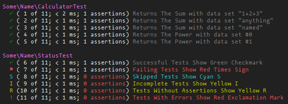

# PhpUnitPrinter

This library holds different printers for phpunit.

ok ok - at the moment there is only one: `TextPrinter`

# How to install

Use composer:

```console
$ composer require tflori/phpunit-printer
```

> note that there is no version defined - composer will automatically install the correct version for your
> php and phpunit version

## Using different phpunit versions in CI

You are maybe developing a library. Then you should not commit the `composer.lock` and you are probably
executing your unit tests on different php and phpunit versions. You will then need to modify your
`composer.json` manually to use any matching version of phpunit and phpunit-printer:

```json
{
  "require": {
    "phpunit/phpunit": "*",
    "tflori/phpunit-printer": "*"
  }
}
```

# How to use

You can now start using it by passing the printer to the phpunit configuration.

Via commandline:
```console
$ phpunit --printer PhpUnitPrinter\TextPrinter
```

Via configuration file:
```xml
<?xml version="1.0" encoding="UTF-8"?>
<phpunit bootstrap="vendor/autoload.php"
         printerClass="PhpUnitPrinter\TextPrinter">
    <!-- ... -->
</phpunit>
```

## Available printer

### TextPrinter

The text printer is a copy of a script I found long time ago on the net. I don't remember where I found
it, and it didn't have annotations.

> If someone knows who has written that printer I would appreciate a hint to honor him in the author
> section.

Example:  

